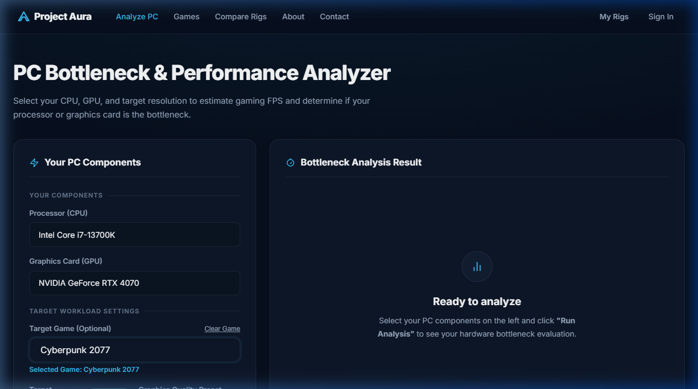
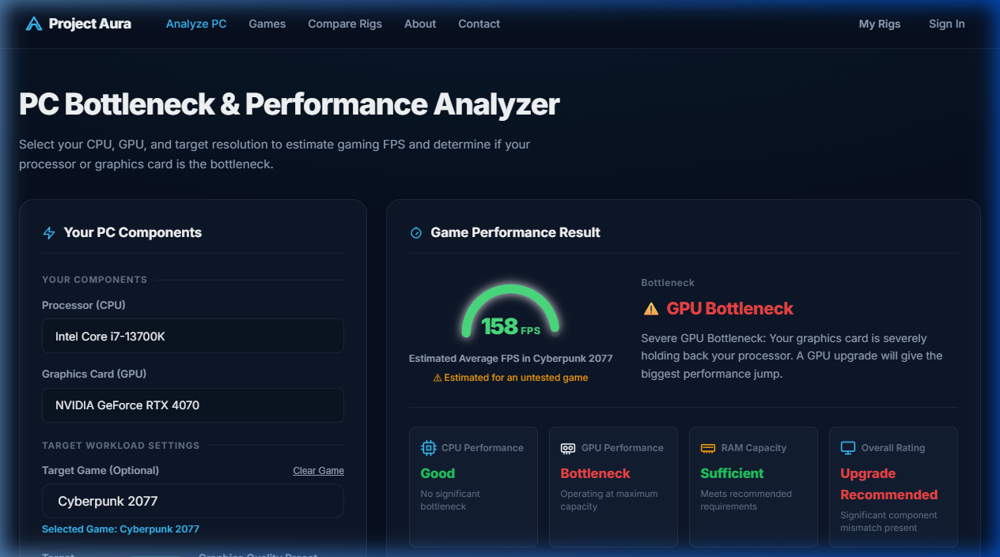
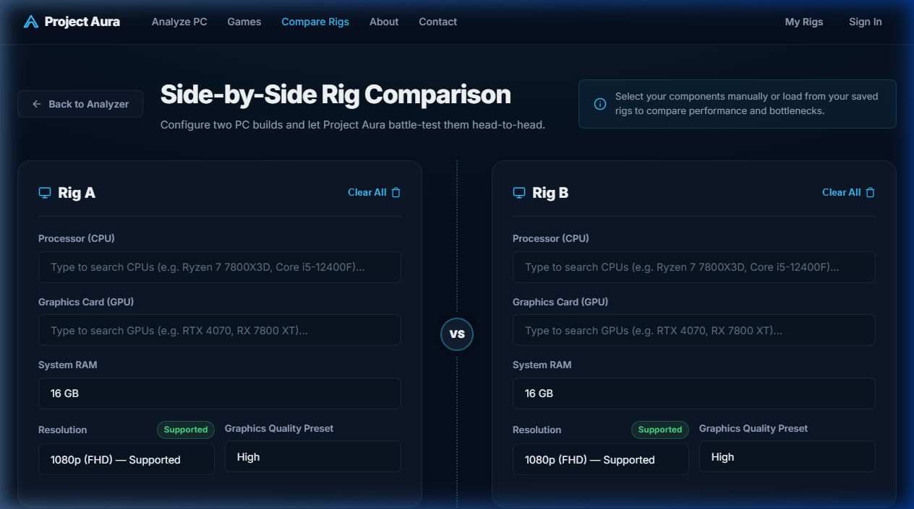
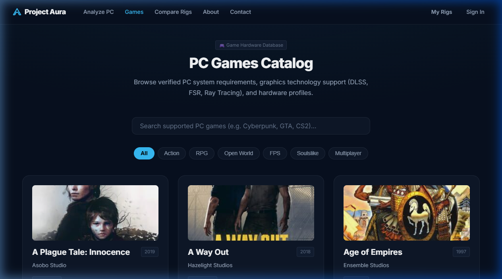
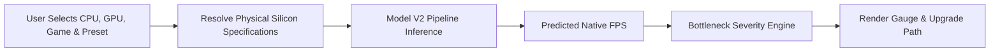
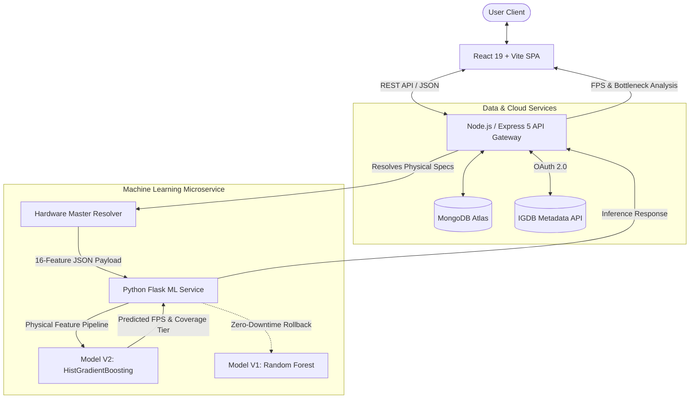
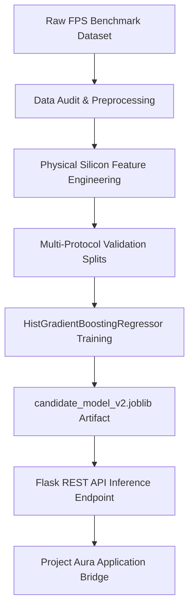

<div align="center">

# Project Aura

### Machine Learning-Powered PC Gaming Performance & Bottleneck Analyzer

Predict gaming framerates (FPS), isolate CPU/GPU hardware bottlenecks, and evaluate component balance using physical silicon specifications and empirical benchmark data.

[](https://scikit-learn.org/)
[](https://www.python.org/)
[](https://scikit-learn.org/)
[](https://react.dev/)
[](https://nodejs.org/)
[](https://expressjs.com/)
[](https://www.mongodb.com/)
[](https://vitejs.dev/)

</div>

---

## 📌 Overview

**Project Aura** is an intelligent PC hardware analysis platform designed for PC gamers, system builders, and hardware enthusiasts. Rather than relying on arbitrary percentage formulas or static hardware name matching, Project Aura evaluates component synergy using **physical silicon properties** (processor cores, clock frequencies, cache capacity, memory bandwidth, shader units, and FP32 compute throughput).

Trained on **24,624 empirical benchmark measurements**, Project Aura Model V2 predicts native gaming framerates across resolutions and graphical presets while identifying hardware bottlenecks with fine-grained precision.

---

## 🖥️ Interface Preview

| PC Bottleneck Analyzer | Performance Result & Bottleneck Gauge |
| :---: | :---: |
| <br><sub>*Interactive component configuration with CPU/GPU autocomplete search*</sub> | <br><sub>*Estimated Average FPS gauge, component status metrics, and upgrade advice*</sub> |

| Side-by-Side Rig Comparison | Game Requirements Catalog |
| :---: | :---: |
| <br><sub>*Dual-system performance comparison with delta metrics*</sub> | <br><sub>*IGDB-synchronized game catalog with system requirements*</sub> |

> *Note: Place full-resolution UI screenshots into [`docs/screenshots/`](docs/screenshots/) to update visual previews.*

---

## ✨ Key Features

| Feature | Description |
| :--- | :--- |
| **ML-Based FPS Prediction** | Continuous framerate estimation powered by a trained `HistGradientBoostingRegressor` model. |
| **Bottleneck Analysis** | Evaluates CPU/GPU throughput balance, isolates limiting hardware, and calculates severity levels. |
| **Physical Hardware Resolver** | Maps user hardware selections to canonical silicon specifications across thousands of CPUs and GPUs. |
| **Game-Aware Modeling** | Calibrated on 24 distinct game engines and graphical preset ordinals (`Low`, `Medium`, `High`, `Ultra`). |
| **Rig Comparison** | Side-by-side comparative simulation between two custom PC hardware builds. |
| **Saved PC Builds (My Rigs)** | Authenticated user profiles for saving, restoring, and managing PC configurations. |
| **Games Catalog** | Searchable database of PC titles with system requirements, ray tracing, DLSS, and FSR metadata from IGDB. |
| **Secure Authentication** | User authentication with bcrypt password hashing (12 rounds) and JWT-protected endpoints. |

---

## ⚙️ How It Works



1. **Selection**: User chooses CPU, GPU, RAM, target game, and graphics preset in the interactive analyzer.
2. **Resolution**: The API Gateway maps hardware selections against the **Hardware Master catalog** to extract 16 continuous silicon specifications.
3. **Inference**: The Python ML microservice executes the `HistGradientBoostingRegressor` pipeline.
4. **Analysis**: The bottleneck engine evaluates processor vs. graphics card headroom and provides component upgrade recommendations.

---

## 🏗️ System Architecture



---

## 🤖 Machine Learning Pipeline

Project Aura Model V2 models gaming framerates from continuous physical silicon attributes rather than categorical hardware names, allowing the model to generalize across unobserved hardware:



### Model V2 Input Feature Contract (16 Features)

| Category | Features | Description |
| :--- | :--- | :--- |
| **CPU Physical (6)** | `CpuNumberOfCores`, `CpuNumberOfThreads`, `CpuFrequency` *(MHz)*, `CpuTurboClock` *(MHz)*, `CpuCacheL3` *(MB)*, `CpuTDP` *(W)* | Processor compute throughput, cache hierarchy, and power profile. |
| **GPU Physical (8)** | `GpuMemorySize` *(MB)*, `GpuBandwidth` *(MB/s)*, `GpuMemoryBus` *(Bits)*, `GpuNumberOfShadingUnits`, `GpuBaseClock` *(MHz)*, `GpuBoostClock` *(MHz)*, `GpuNumberOfROPs`, `GpuFP32Performance` *(GFLOPS)* | Graphics compute capacity, rasterization units, and memory subsystem. |
| **Workload (2)** | `GameName` *(OneHot Encoded)*, `GameSetting_Ordinal` *(1=Low, 2=Med, 3=High, 4=Ultra)* | Target game title and graphics workload complexity. |

*Target variable:* **`FPS`** (Average frame delivery rate) — strictly isolated to prevent target leakage.

<details>
<summary><b>View Detailed Feature Table</b></summary>

| Feature Name | Type | Unit | Example Value |
| :--- | :--- | :--- | :--- |
| `CpuNumberOfCores` | Float | Cores | `8.0` |
| `CpuNumberOfThreads` | Float | Threads | `16.0` |
| `CpuFrequency` | Float | MHz | `3600.0` |
| `CpuTurboClock` | Float | MHz | `5000.0` |
| `CpuCacheL3` | Float | MB | `32.0` |
| `CpuTDP` | Float | Watts | `105.0` |
| `GpuMemorySize` | Float | MB | `12000.0` |
| `GpuBandwidth` | Float | MB/s | `504000.0` |
| `GpuMemoryBus` | Float | Bits | `192.0` |
| `GpuNumberOfShadingUnits`| Float | Cores | `5888.0` |
| `GpuBaseClock` | Float | MHz | `1980.0` |
| `GpuBoostClock` | Float | MHz | `2475.0` |
| `GpuNumberOfROPs` | Float | ROPs | `64.0` |
| `GpuFP32Performance` | Float | GFLOPS | `29150.0` |
| `GameName` | String | Categorical | `"apexLegends"` |
| `GameSetting_Ordinal` | Integer | Ordinal (1–4) | `2` *(Medium)* |

</details>

---

## 📊 Model V2 Evaluation

Model V2 was evaluated across four independent validation protocols to test in-distribution accuracy and real-world generalization:

| Validation Protocol | Evaluation Focus | MAE (FPS) | RMSE (FPS) | R² Score |
| :--- | :--- | :---: | :---: | :---: |
| **1. Standard Holdout** | In-distribution random split (80/20) | **1.69 FPS** | **2.32 FPS** | **0.9982** |
| **2. Unseen CPU Holdout** | Generalization to 4 held-out processor architectures | **2.47 FPS** | **3.12 FPS** | **0.9967** |
| **3. Unseen GPU Holdout** | Generalization to 5 held-out graphics cards | **4.75 FPS** | **6.01 FPS** | **0.9872** |
| **4. Unseen Game Holdout** | Generalization to 4 unobserved game engines | **16.58 FPS** | **20.45 FPS** | **0.6000** |

### Understanding the Evaluation Metrics
- **Mean Absolute Error (MAE)**: Measures average prediction error. An MAE of **1.69 FPS** means predictions differed from empirical benchmarks by approximately 1.69 FPS on average. *(MAE indicates average expected error across the dataset, not a guaranteed range).*
- **Root Mean Squared Error (RMSE)**: Penalizes larger outlier deviations. The low standard RMSE of **2.32 FPS** reflects consistent accuracy without extreme prediction spikes.
- **Coefficient of Determination ($R^2$)**: Represents the percentage of variance explained by the model ($R^2 = 0.9982$ on standard holdout).

---

## 🔄 Model V1 vs. Model V2

| Dimension | Model V1 (Legacy Baseline / Rollback) | Model V2 (Production Model) |
| :--- | :--- | :--- |
| **Algorithm** | `RandomForestRegressor` (100 estimators) | `HistGradientBoostingRegressor` |
| **Input Representation** | 71-dimension categorical one-hot hardware names | 16 continuous physical silicon features + game + preset |
| **Unseen Hardware** | Degrades (one-hot columns collapse to zero) | Robust (evaluates continuous physical silicon properties) |
| **Game Awareness** | 0 games (uncalibrated generic workload) | 24 trained game titles with preset scaling |
| **Artifact Size** | 6.5 MB (`project_aura.joblib`) | 554 KB (`candidate_model_v2.joblib`) |
| **Operational Role** | Preserved operational rollback path | Active production inference candidate |

> **Evaluation Context**: Model V1 and Model V2 were trained on different historical datasets (1,000-row synthetic/legacy dataset vs. 24,624-row empirical benchmark dataset). Their metrics represent distinct evaluation methodologies rather than a direct apples-to-apples training split.

---

## 📦 Dataset Scope

<div align="center">

| 24,624 | 19 | 27 | 24 |
| :---: | :---: | :---: | :---: |
| **Clean Benchmark Rows** | **Unique CPUs** | **Unique GPUs** | **PC Game Titles** |

</div>

- **CPUs**: Intel Core 6th–12th Gen (i3, i5, i7, i9) & AMD Ryzen 1000–5000 Series (Ryzen 3, 5, 7).
- **GPUs**: NVIDIA GeForce GTX 10-series, RTX 20/30-series & AMD Radeon RX 500, RX 5000/6000-series.
- **Resolution**: Standardized 1080p native rendering benchmark data.

*(Authoritative Note: Early documentation referenced 54 GPUs; data auditing confirmed that counted GPU/preset profile combinations rather than unique physical GPU silicon dies).*

---

## 🛠️ Technology Stack

| Layer | Technologies |
| :--- | :--- |
| **Frontend** | React 19, Vite, Vanilla CSS Design System, Axios |
| **Backend API Gateway** | Node.js 20, Express 5, Mongoose 8, JWT, bcryptjs, express-rate-limit |
| **Machine Learning** | Python 3.13, Flask, scikit-learn (`HistGradientBoostingRegressor`), joblib, pandas, NumPy |
| **Database** | MongoDB Atlas Cloud |
| **External APIs** | IGDB API via Twitch OAuth 2.0 |
| **Testing** | Jest, Supertest, Pytest, ESLint |

---

## 📂 Project Structure

```
hardware-bottleneck-analyzer/
├── frontend-react/               # React 19 + Vite User Interface
│   ├── src/
│   │   ├── components/           # UI components (Navbar, Footer, Modals, Gauges)
│   │   ├── constants/            # Routes, stores, hardware definitions
│   │   ├── hooks/                # Custom React hooks (useAuth, useHardwareData)
│   │   ├── pages/                # BottleneckCalculatorPage, GamesPage, Compare, About
│   │   ├── services/             # API client & service layer (auth, analysis, rigs)
│   │   ├── utils/                # Bottleneck logic & evaluation engine
│   │   └── index.css             # Dark gaming design system
│   └── package.json
│
├── backend-node/                 # Express 5 API Gateway
│   ├── config/                   # MongoDB database connection
│   ├── middleware/               # JWT authentication & rate limiters
│   ├── models/                   # Mongoose schemas (User, Game, HardwareCpu, HardwareGpu)
│   ├── routes/                   # Modular API routers (auth, user, hardware, predict, games)
│   ├── services/                 # Hardware Master & Model V2 feature resolver
│   ├── server.js                 # Express server entry point
│   └── package.json
│
├── ai-python/                    # Python Flask ML Microservice
│   ├── ml-model-v2/              # Model V2 Engineering
│   │   ├── data/                 # Raw & cleaned benchmark datasets
│   │   ├── experiments/          # Baseline candidate artifacts, error analysis & metrics
│   │   ├── prepare_dataset_v2.py # 16-feature dataset preparation pipeline
│   │   ├── train_model_v2.py     # Training & multi-protocol validation suite
│   │   └── test_model_v2.py      # Pytest validation suite
│   ├── app.py                    # Flask dual-model prediction API (v1 & v2)
│   ├── project_aura.joblib       # Model V1 artifact (Rollback)
│   ├── test_app.py               # Model V1 endpoint tests
│   ├── test_model_v2_integration.py # Integration test suite
│   └── requirements.txt          # Python dependencies
│
├── docs/                         # Technical Specifications & Interview Guides
│   ├── INTERVIEW_GUIDE.md        # Technical interview reference & discussion guide
│   ├── RELEASE_CHECKLIST.md      # Production release checklist
│   ├── ML_DATASET_V2_AUDIT.md    # Machine learning dataset audit
│   └── DATASET_V2_SCHEMA.md      # Physical feature contract schema
│
├── .env.example                  # Environment configuration template
└── README.md                     # Project documentation
```

---

## 🚀 Getting Started

### Prerequisites
- **Node.js** (v18.0+ or v20.0+)
- **Python** (v3.10+ or v3.13+)
- **MongoDB Atlas** connection URI
- **npm** and **pip**

---

### 1. Start the Python ML Microservice
```bash
cd ai-python

# Create and activate virtual environment
python -m venv venv
venv\Scripts\activate      # Windows
# source venv/bin/activate # Linux/macOS

# Install dependencies
pip install -r requirements.txt

# Start Flask prediction service (Port 5000)
python app.py
```

### 2. Start the Node.js Backend API
```bash
cd backend-node

# Install dependencies
npm install

# Configure environment variables
cp .env.example .env

# Start Express server (Port 4000)
node server.js
```

### 3. Start the React Frontend
```bash
cd frontend-react

# Install dependencies
npm install

# Start Vite dev server (Port 5173)
npm run dev
```

---

## 🔑 Environment Variables

Create `.env` in `backend-node/`:

```env
PORT=4000
NODE_ENV=development
MONGO_URI=mongodb+srv://<username>:<password>@<cluster>.mongodb.net/project_aura
JWT_SECRET=your_jwt_secret_key_here
AURA_AI_URL=http://127.0.0.1:5000
MODEL_VERSION=v2
EMAIL_USER=your_email@gmail.com
EMAIL_PASS=your_email_app_password_here
IGDB_CLIENT_ID=your_twitch_client_id_here
IGDB_CLIENT_SECRET=your_twitch_client_secret_here
```

*(Optional)* Create `.env` in `frontend-react/`:
```env
VITE_API_URL=http://localhost:4000
```

---

## 📡 API Reference

### Predict Gaming FPS & Bottleneck
`POST /api/predict`

**Request (Model V2 Payload)**:
```json
{
  "modelVersion": "v2",
  "GameName": "apexLegends",
  "GameSetting_Ordinal": 2,
  "CpuNumberOfCores": 6,
  "CpuNumberOfThreads": 6,
  "CpuFrequency": 3000,
  "CpuTurboClock": 4400,
  "CpuCacheL3": 9,
  "CpuTDP": 65,
  "GpuMemorySize": 6000,
  "GpuBandwidth": 336000,
  "GpuMemoryBus": 192,
  "GpuNumberOfShadingUnits": 1408,
  "GpuBaseClock": 1530,
  "GpuBoostClock": 1785,
  "GpuNumberOfROPs": 48,
  "GpuFP32Performance": 5027000
}
```

**Response (HTTP 200 OK)**:
```json
{
  "predictedFps": 98.42,
  "predicted_fps": 98.42,
  "modelVersion": "v2",
  "gameCoverage": "known",
  "resolution": "1080p",
  "preset": "Medium",
  "game": "apexLegends"
}
```

<details>
<summary><b>View Additional API Endpoints</b></summary>

| Endpoint | Method | Description | Auth Required |
| :--- | :---: | :--- | :---: |
| `/api/hardware/cpus/search` | `GET` | Autocomplete search for CPUs | No |
| `/api/hardware/gpus/search` | `GET` | Autocomplete search for GPUs | No |
| `/api/games` | `GET` | Paginated PC games catalog | No |
| `/api/games/:slug` | `GET` | Detailed game requirements & tech profile | No |
| `/api/auth/register` | `POST` | Register a new user account | No |
| `/api/auth/login` | `POST` | Authenticate and retrieve JWT token | No |
| `/api/user/rigs` | `GET` | Fetch saved PC configurations | Yes (JWT) |
| `/api/user/rigs` | `POST` | Save a new PC configuration | Yes (JWT) |
| `/api/user/rigs/:rigId` | `DELETE`| Remove a saved PC configuration | Yes (JWT) |

</details>

---

## 🧪 Testing & Verification

| Test Suite | Framework | Passing Tests | Status |
| :--- | :--- | :---: | :---: |
| **Python ML Microservice** | Pytest | **19 / 19** | `PASS` |
| **Node.js Backend Gateway** | Jest / Supertest | **162 / 162** (8 Suites) | `PASS` |
| **Frontend Code Quality** | ESLint | **0 Errors** (1 Warning) | `PASS` |
| **Frontend Production Build**| Vite | **Clean Build** (7.96s) | `PASS` |

---

## ⚠️ Current Limitations

1. **Native 1080p Scope**: Model V2 was trained and validated on native 1080p benchmark observations. 1440p and 4K estimations utilize application-level baseline scaling rather than native higher-resolution ML training.
2. **Graphics Presets**: Native training encompasses Medium and Ultra presets; Low and High presets are normalized cleanly to corresponding ordinals.
3. **Training Catalog (24 Games)**: Untested game titles are supported via categorical one-hot unseen handling, but carry higher variance (MAE: 16.58 FPS). The UI explicitly labels these as `"⚠️ Estimated for an untested game"`.
4. **Estimation Nature**: Predictions represent statistical approximations under standard thermal and benchmark conditions, not a manufacturer-guaranteed framerate.

---

## 📚 Technical Documentation

- 📖 [Technical Interview & Portfolio Guide](docs/INTERVIEW_GUIDE.md) — Comprehensive reference on ML decisions, metrics, and architecture.
- 📋 [Production Release Checklist](docs/RELEASE_CHECKLIST.md) — Pre-flight verification checklist for deployment.
- 🔬 [ML Dataset V2 Audit](docs/ML_DATASET_V2_AUDIT.md) — Data provenance, exploratory analysis, and feature justification.
- 📐 [Dataset V2 Schema Specification](docs/DATASET_V2_SCHEMA.md) — Exact feature contract definitions.

---

## 🚦 Project Status & Future Work

**Project Aura V2 Status:** `COMPLETE`

### Future Exploration (Planned)
- [ ] **Multi-Resolution ML Modeling**: Native training across 1440p and 4K empirical benchmark datasets.
- [ ] **1% Low Framerate Modeling**: Secondary regressor for 99th percentile frametime / micro-stutter prediction.
- [ ] **Expanded Game Catalog**: Continuous automated benchmark ingestion across modern gaming titles.

---

## 📄 License & Attribution

- **Repository License**: Not yet selected (reserved for project owner).
- **FPS Benchmark Dataset**: Kaggle — *FPS Benchmark* by Ulrik Thyge Pedersen (`License Status: NEEDS_VERIFICATION`). Used exclusively for educational, non-commercial research and portfolio demonstration.
- **Game Metadata**: Provided via the [Internet Game Database (IGDB)](https://www.igdb.com/) API under Twitch OAuth developer terms.