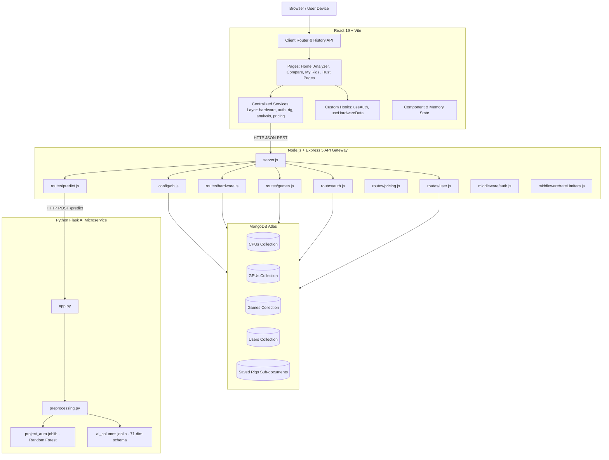

# Project Aura Architecture & Technical Specification

> **Version:** 2.0 (Branch: `V2`)  
> **Platform:** ML-Powered PC Gaming Performance & Bottleneck Analysis Platform

---

## 1. High-Level Architecture Diagram

---

## 2. Core Subsystems

### A. Frontend Application (`frontend-react/`)
- **Technology**: React 19, Vite, Vanilla CSS design system.
- **Client Routing**: Native browser `pushState` / `popstate` router with direct path normalization, dynamic document titles, and SEO metadata.
- **Services Layer (`src/services/`)**:
  - `apiClient.js`: Configured Axios instance with auto-injected JWT authorization headers and base URL fallback.
  - `hardwareService.js`: Autocomplete search, lightweight hardware lists, and performance stats.
  - `authService.js`: User login, registration, password recovery, and token storage.
  - `rigService.js`: User rig profile persistence and deletion.
  - `analysisService.js`: Bottleneck and FPS prediction bridge.
  - `pricingService.js`: Live quotation estimation.
- **State Hooks (`src/hooks/`)**:
  - `useAuth()`: Session state management.
  - `useHardwareData()`: Pre-caches lightweight CPU/GPU datasets and scaling factors.

### B. Node.js API Gateway (`backend-node/`)
- **Technology**: Node.js, Express 5, Mongoose 8.
- **Security & Reliability**:
  - ReDoS prevention via `escapeRegex.js`.
  - Rate limiting on auth (`/api/auth/*`) and pricing (`/api/pricing/*`).
  - Strict JSON body limits (`100kb`).
  - User isolation on saved rig operations (`req.user.id`).
- **Modular Routes (`routes/`)**:
  - `hardware.js`: CPU/GPU searches, lightweight catalogs, max performance stats.
  - `predict.js`: Validates hardware specs and bridges requests to the Python AI service.
  - `auth.js`: Registration, bcrypt hashing, JWT issuance, password reset.
  - `user.js`: User profile and saved rigs CRUD.
  - `pricing.js`: AI-driven retail estimation.

### C. Python AI Prediction Service (`ai-python/`)
- **Technology**: Python 3.13, Flask, scikit-learn, joblib, pandas.
- **Model**: Trained Random Forest Regressor (`project_aura.joblib`) mapping 71 hardware, resolution, and quality dimensions to gaming framerates.
- **Preprocessing Pipeline (`preprocessing.py`)**:
  - Normalizes frontend resolution labels (1080p, 1440p, 4K) to pixel resolutions (`1920x1080`, `2560x1440`, `3840x2160`).
  - Normalizes processor naming schemes.
  - Clamps numerical specs within realistic physical bounds (`safe_num`).
  - Encodes categorical fields and aligns columns to the exact training schema (`ai_columns.joblib`).

---

## 3. End-to-End Prediction Data Flow

1. **User Input**: User selects CPU, GPU, RAM, Resolution, and Graphics Quality.
2. **Frontend Validation**: Ensures valid CPU and GPU records are selected before initiating network requests.
3. **API Bridge**: `analysisService.predictFps` sends a `POST /api/predict` request to the Express API.
4. **Microservice Call**: Express validates payload structure and forwards the payload to the Flask microservice (`http://127.0.0.1:5000/predict`).
5. **Preprocessing & Inference**: Flask pre-processes features into the 71-dimension vector, queries the Random Forest regressor, applies bounds clamping, and returns the raw estimated FPS.
6. **Hardware Scaling & Bottleneck Math**: `BottleneckLogic.js` evaluates relative CPU Mark and GPU CUDA scores against database maxima using a square-root scaling formula:
   $$\text{Scaling Score} = \sqrt{\text{Raw Score} / \text{Max Score}} \times 100$$
7. **UI Presentation**: The frontend renders the predicted FPS, bottleneck severity meter, component balance tabs, smart upgrade suggestions, and technical explanations.
