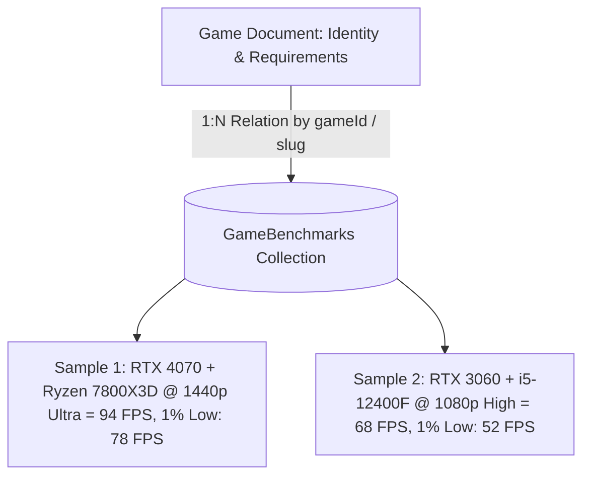

# Project Aura: Game Data Strategy & Technical Specification

> **Version:** 1.0 (Phase V2.1)  
> **Purpose:** Guidelines for game metadata acquisition, system requirements verification, benchmark separation, and future engine integration.

---

## 1. Core Principles

1. **Accuracy & Truthfulness**: Never fabricate system requirements, framerates, or performance metrics. If official specs are missing, explicitly display the record as `metadata_only` or `unverified`.
2. **Provenance & Source Attribution**: Every requirement entry must record its official source (e.g. Steam Store, publisher press kit, developer announcement) and verification timestamp.
3. **Decoupled Benchmark Architecture**: Never store granular benchmark samples directly within the `Game` document. Keep game identity lightweight and scale benchmark observations in a dedicated collection.
4. **Controlled Data Ingestion**: No uncontrolled scraping. Data is populated via curated JSON datasets, manual administrative verification, or official APIs.

---

## 2. Data Hierarchy & Quality Tiers

| Data Tier | Meaning | Frontend Indicator |
| :--- | :--- | :--- |
| `metadata_only` | Title, release year, developer, publisher, and genre tags are available. System requirements are uncollected. | "Basic Profile" |
| `requirements_available` | Community or unverified publisher requirements gathered, awaiting manual review. | "Requirements Available" |
| `verified` | Requirements confirmed against official developer documentation by the Project Aura team. | "✓ Official Specs Verified" |

---

## 3. Game Schema Architecture

The `Game` model (`backend-node/models/Game.js`) enforces structured storage:

```javascript
{
  name: "Cyberpunk 2077",
  slug: "cyberpunk-2077",
  alternateNames: ["CP2077"],
  developer: "CD Projekt Red",
  publisher: "CD Projekt",
  releaseDate: "2020-12-10",
  releaseYear: 2020,
  genres: ["RPG", "Open World", "Action"],
  platforms: ["PC"],
  requirements: {
    minimum: {
      cpu: { name: "Intel Core i7-6700 / AMD Ryzen 5 1600", notes: "64-bit required" },
      gpu: { name: "NVIDIA GTX 1060 6GB / AMD RX 580 8GB", vramGB: 6 },
      ramGB: 12,
      storageGB: 70,
      storageType: "SSD",
      os: "Windows 10 64-bit",
      directX: "Version 12"
    },
    recommended: {
      cpu: { name: "Intel Core i7-12700 / AMD Ryzen 7 7800X3D", notes: null },
      gpu: { name: "NVIDIA RTX 2060 Super / AMD RX 5700 XT", vramGB: 8 },
      ramGB: 16,
      storageGB: 70,
      storageType: "SSD",
      os: "Windows 10 / 11 64-bit",
      directX: "Version 12"
    }
  },
  performanceProfile: {
    supportedResolutions: ["1080p", "1440p", "4K"],
    graphicsPresets: ["Low", "Medium", "High", "Ultra"],
    cpuIntensity: "High",
    gpuIntensity: "High",
    vramIntensity: "High",
    ramIntensity: "Medium",
    rayTracingSupported: true,
    dlssSupported: true,
    fsrSupported: true,
    xessSupported: true
  },
  dataQuality: "verified",
  dataSource: {
    requirementsSource: "Official CD Projekt Red 2.0 Update Requirements",
    requirementsVerified: true,
    lastVerifiedAt: ISODate("2026-08-31T00:00:00.000Z")
  }
}
```

---

## 4. Benchmark Separation Architecture (Future V2.2)

Granular benchmark observations will be stored in a separate collection: `GameBenchmark`:



### Proposed `GameBenchmark` Schema
* `gameId`: Reference ObjectId -> Game
* `gameSlug`: String (indexed)
* `cpuName`: String
* `gpuName`: String
* `ramGB`: Number
* `resolution`: Enum ('1080p', '1440p', '4K')
* `preset`: Enum ('Low', 'Medium', 'High', 'Ultra')
* `averageFps`: Number
* `onePercentLow`: Number
* `rayTracing`: Boolean
* `upscaling`: Enum ('None', 'DLSS_Quality', 'FSR_Quality', etc.)
* `source`: String (e.g., 'Internal Benchmark Rig', 'CapFrameX Verified Submission')
* `capturedAt`: Date

---

## 5. Requirement Matcher Architecture (Future Can I Run It)

Because official requirement strings (e.g. `"Intel Core i5-3570K / AMD FX-8350"`) differ from database component names, a future `requirementMatcher.js` service will perform:

1. **Text Normalization**: Strip brand prefixes, punctuation, and frequency suffixes.
2. **Component Tokenization**: Split `"Intel Core i5-3570K / AMD FX-8350"` into discrete candidates.
3. **Database Catalog Lookup**: Resolve each candidate to known `cpuMark` and `CUDA` baseline scores.
4. **Hardware Tier Evaluation**:
   * If User CPU Score >= Minimum Requirement CPU Score &rarr; `PASS_MINIMUM`
   * If User CPU Score >= Recommended Requirement CPU Score &rarr; `PASS_RECOMMENDED`
   * If User CPU Score < Minimum Requirement CPU Score &rarr; `BELOW_MINIMUM`

---

## 6. Data Ingestion & Maintenance Workflow

1. **Catalog Expansion**: Populate new games into `backend-node/seeds/games.json`.
2. **Verification Check**: Validate developer requirements against store pages.
3. **Safe Upsert**: Execute `node backend-node/scripts/seedGames.js`.
4. **Zero Downtime**: Database updates apply immediately via unique slug matching without deleting historical user data.
